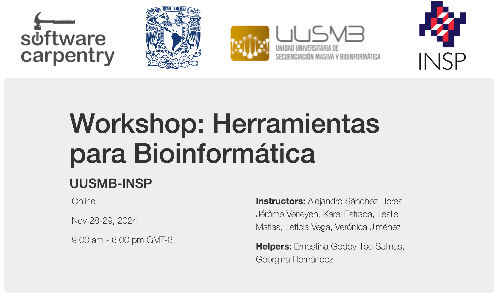

# [*Programming wiyth Python*](https://swcarpentry.github.io/python-novice-inflammation/): eposodios 5 a 8 
Traducción de los episodios 5 a 8 de la lección ["Programming wiyth Python"](https://swcarpentry.github.io/python-novice-inflammation/) de software carpentry , para impartir el curso de python en el marco del [*Workshop*: Herramientas para Bioinformática](https://tgodoy.github.io/2024-11-28-UUSMB_INSP-online/). 28 y 29 de noviembre de 2024.

## Instalando Python y Jupyter
Python es un lenguaje ampliamente utilizado en diferentes áreas de investigación y también destaca como una excelente opción para la programación en general. Dado que la instalación individual de todos sus paquetes puede resultar algo compleja, recomendamos usar Anaconda, un instalador todo enuno que simplifica el proceso. Independientemente del método de instalación que elija, es importante asegurarse de instalar la versión 3.x de Python (por ejemplo, la 3.6 es perfectamente válida).

En este curso, aprenderemos Python utilizando Jupyter Notebook (https://jupyter.org/), un entorno de programación que se ejecuta directamente en el navegador web. Este entorno será instalado a través de Anaconda y para que funcione correctamente, necesitarás un navegador actualizado. Las versiones recientes de Chrome, Safari y Firefox son completamente compatibles, mientras que algunos navegadores más antiguos, como Internet Explorer 9 y versiones anteriores, no lo son.

